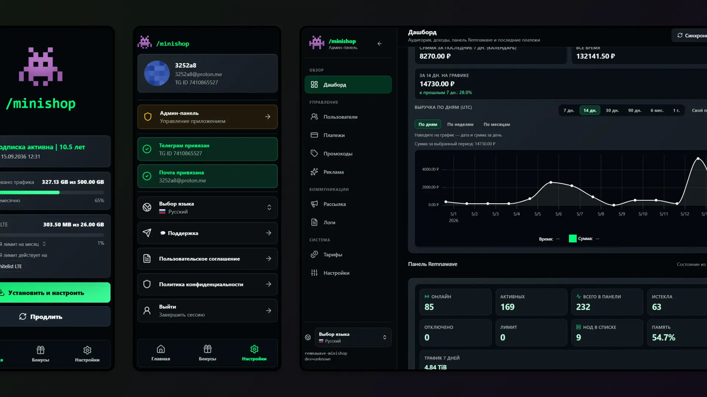

# Remnawave Minishop



Remnawave Minishop — Telegram 机器人和 Web App (Mini App), 用于销售和管理 [Remnawave](https://docs.rw/) 面板订阅。机器人处理注册、支付、续费、试用期、优惠码、推荐和在线客服。Web App 显示连接链接、有效期、流量、支付、设备和通过 Telegram Mini Apps `initData`、Telegram OAuth / OpenID Connect 及一次性邮箱验证码登录。

本项目是 [kavore/remnawave-tg-shop](https://github.com/kavore/remnawave-tg-shop) 的重构分支。如需从旧技术栈和其他机器人迁移数据, 请使用[迁移章节](docs/migrations/index.md)。

## 功能

用户端默认使用中文界面, 并可切换俄语或英语:

- 注册时默认中文, 可选择俄语或英语;
- 查看订阅状态、到期日期、连接链接和流量;
- 购买订阅、流量包、普通和 Premium 流量补充、按配置套餐目录购买设备;
- Web App / Mini App 支持通过 Telegram 或邮箱登录;
- Mini App 内置安装指南: 个人 `/install` 页面和用于分享指南的公开链接 `/s/<token>`;
- 试用期、优惠码和推荐计划;
- 通过 YooKassa、FreeKassa、Platega、SeverPay、Wata、CryptoPay、Heleket、PayKilla、LAVA、CloudPayments、Stripe 和 Telegram Stars 支付;
- Web App 中的客服工单和外部客服链接;
- 启用 `MY_DEVICES_SECTION_ENABLED` 后的"我的设备"板块。

管理端:

- 面向 `ADMIN_IDS` 用户的管理面板 (仅限 Telegram 登录, 不适用于纯邮箱账户);
- 用户、订阅、支付和 Remnawave 同步统计;
- 用户列表, 支持搜索、筛选和 Premium 流量列;
- 用户封禁、工单客服、群发、优惠码、操作日志以及通过界面覆盖 `.env` 的应用设置;
- JSON 套餐目录编辑器, 支持周期/流量模式、Internal Squads、Premium Squads 和 HWID 设备包;
- 连接指南设置: 从 Remnawave Panel 读取 Subscription Page 配置、可选的 JSON 覆盖和机器人按钮行为切换;
- 手动同步用户和订阅到面板。

## 文档

- [文档首页](docs/index.md) — 安装、配置、支付、管理和诊断导航。
- [部署](docs/getting-started/deployment.md) — Docker Compose、Caddy、Nginx、Pangolin/Newt 及无反向代理启动。
- [环境配置](docs/getting-started/configuration.md) — 引导 `.env` 和推荐的 Web App 管理界面配置。
- [`.env` 变量](docs/configuration/env-vars.md) — 所有环境变量键的完整参考, 按板块分类。
- [备份与恢复](docs/features/backups.md) — 自动归档、Telegram 发送和通过管理界面恢复。
- [套餐](docs/features/tariffs.md) — 套餐目录、周期和流量模式、普通和 Premium 补充、Premium Squads、套餐更换、HWID 限制和流量处理。
- [管理面板](docs/features/admin-panel.md) — 访问权限、设置、套餐编辑器、Premium Squads 和 JSON 目录保存。
- [Web 应用 / Mini App](docs/features/web-app.md) — 独立端口、域名、安装指南和推荐链接。
- [Telegram 授权](docs/features/telegram-auth.md) 和 [邮箱登录](docs/features/email-login.md) — BotFather/OAuth 和 SMTP 登录设置。
- [用户客服 / 工单](docs/features/support.md) — Mini App 工单、管理端收件箱、通知、限制和外部客服链接。
- [Web App 主题](docs/features/webapp-themes.md) — 自定义主题、外观设置、Logo、CSS/资源和新主题创建流程。
- [迁移](docs/migrations/index.md) — 从 `remnawave-tg-shop` 和 Remnashop 迁移的现成方案。
- [从 remnawave-tg-shop 迁移](docs/migrations/remnawave-tg-shop.md) 和 [Remnashop](docs/migrations/remnashop.md) — 通过通用安装向导的方案。

## 兼容性

与 Remnawave 面板 API 的集成 (webhook、用户、订阅、管理统计等) 已在 Remnawave **`> 2.7.0`** 版本面板上**测试通过**。更旧的版本可能部分工作或完全不工作, 因 API 有变更。

## 技术栈

构建和运行环境由 **deploy/docker/Dockerfile** 和 **docker-compose.yml** 定义; 精确的包版本在 **go.mod** 和 **frontend/package.json** 中。

| 层级 | 技术 |
| --- | --- |
| 后端 | Go **1.26**, `net/http`, `chi/v5`, `pgx/v5`, `redis/go-redis/v9`, `github.com/go-telegram/bot` |
| 数据 | **PostgreSQL** **17** (Compose 中的 `postgres` 服务) 和 **Redis** **7** (`redis` 服务) |
| Web App 构建 | **Node.js** **22**, **Svelte** **5**, **Vite**, **Tailwind CSS** 4; 构建产物放入 `internal/webassets/templates/` 模板目录 |

无 Docker 的本地开发需安装 Go 1.26、PostgreSQL 和 (用于重新构建前端) Node 22; 典型场景为全部通过 Compose 运行。

## 快速开始

要求:

- Docker 和 Docker Compose;
- 运行中的 Remnawave 面板版本 **`> 2.7.0`** (参见"兼容性"章节);
- Telegram 机器人 Token;
- 用于 webhook 和 Mini App 的公开域名。

```bash
git clone https://remna-user-panel
cd remnawave-minishop
cp .env.example .env
nano .env
docker compose up -d --build
docker compose logs -f backend worker frontend
```

`.env` 中至少填写:

- `BOT_TOKEN` — Telegram 机器人 Token;
- `ADMIN_IDS` — 管理员 Telegram ID, 逗号分隔;
- `WEBHOOK_BASE_URL` — webhook 公开 URL;
- `POSTGRES_USER`, `POSTGRES_PASSWORD`, `POSTGRES_DB` — PostgreSQL 凭据;
- `WEBAPP_ENABLED=True` — 启用 Web App 和管理面板以便首次登录;
- `WEBAPP_SESSION_SECRET`, `WEBHOOK_SECRET_TOKEN` — 稳定的密钥;
- `SUBSCRIPTION_MINI_APP_URL` — Mini App/前端的公开 HTTPS URL, 例如 `https://app.domain.com/`;
- `PANEL_API_URL`, `PANEL_API_KEY`, `PANEL_WEBHOOK_SECRET` — Remnawave 访问凭据;
- `TRUSTED_PROXIES` — 对于 Docker/Caddy/Nginx/Newt 保留默认值, 或指定反向代理的 IP/CIDR, 以便支付 webhook 的 IP 白名单能识别真实的提供商;
- 其余设置在 Web App 管理界面中配置更方便。

在 Remnawave Panel 中设置 `WEBHOOK_URL` 为 Minishop 的公开地址加路径 `/webhook/panel`, 例如 `https://app.example.com/webhook/panel`。Webhook 密钥在 Remnawave Panel 中设置; 将相同的值填入 `.env` 的 `PANEL_WEBHOOK_SECRET` 或管理界面的 **系统 -> 设置 -> Remnawave Panel**。

首次登录管理界面后, 通过 UI 配置套餐、支付商、外观、客服、通知和连接指南。安装指南默认启用, 从 Remnawave Panel 读取 Subscription Page 配置, 配置有问题时回退到普通连接链接。完整环境变量参考: [docs/configuration/env-vars.md](docs/configuration/env-vars.md)。

套餐目录使用 `TARIFFS_CONFIG_PATH`, 默认值为 `data/tariffs.json`。示例格式见 [data/tariffs.example.json](data/tariffs.example.json), 详情见 [docs/features/tariffs.md](docs/features/tariffs.md)。

在 Docker 中, 此文件不仅需要被 `backend` 和 `worker` 访问, 还需要被一次性服务 `migrate` 访问: 迁移器在将现有订阅绑定到默认套餐时会读取套餐目录。当前 compose 文件中整个 `/app/data` 已挂载到 `migrate`、`backend` 和 `worker`; 如果手动迁移 compose, 请为所有三个服务保持相同的挂载。

在 compose 示例中, `/app/data` 从 `docker-compose.yml` 旁的 `./data` 文件夹挂载。请提前创建目录并将其交给容器用户。这是保存 `data/tariffs.json`、主题目录 `data/themes` 和 Web App Logo 缓存所必需的:

```bash
mkdir -p data/themes data/webapp-logo data/tariffs
touch data/locales-overrides.json
chown -R 10001:10001 data
chmod -R u+rwX data
```

## 实用命令

```bash
# 本地构建和启动
docker compose up -d --build

# 应用日志
docker compose logs -f backend worker frontend

# 推荐的生产环境方案 (使用 Caddy)
cd deploy/examples/caddy      # 或 nginx, newt, no-proxy
cp .env.example .env
nano .env
docker compose up -d

# 从预构建镜像以特定标签启动
IMAGE_TAG=3.1.0 docker compose up -d
```

生产环境部署建议使用 [`deploy/examples`](deploy/examples) 中的现成文件夹, 并在 [docs/getting-started/deployment.md](docs/getting-started/deployment.md) 中阅读权威指南。普通公开服务器的首选方案是 Caddy: 它自动签发和续期 HTTPS 证书。Compose 旁的文件夹仅包含配置文件和文档的简短链接。

发布镜像名称:

- `ghcr.io/<namespace>/remna-user-panel-backend`
- `ghcr.io/<namespace>/remna-user-panel-worker`
- `ghcr.io/<namespace>/remna-user-panel-frontend`
