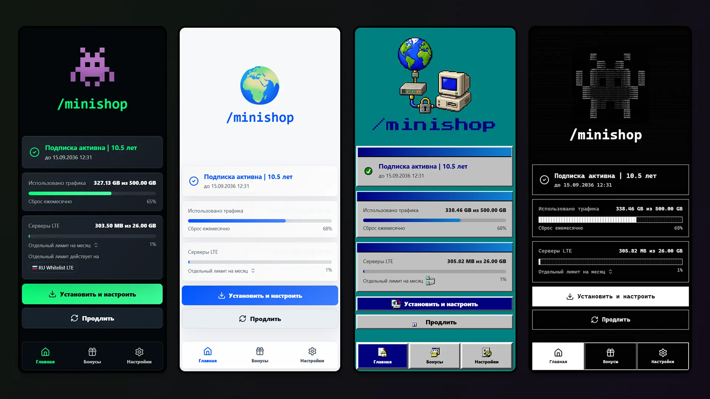

> **Обновление темы по умолчанию.** Встроенная `dark` теперь является канонической темой по умолчанию и содержит
> два варианта: `dark` и `light`. Старый ключ `light` сохранён как скрытый
> alias совместимости, поэтому существующие ссылки `WEBAPP_DEFAULT_THEME=light` и `/home?theme_preview=light`
> по-прежнему открывают светлый вариант, но админы настраивают его через единую карточку Default theme.
> Карточка поддерживает удобную no-code настройку: пресеты, переключатель dark/light, токены палитры,
> радиус, масштаб логотипа для десктопа/мобильного, отдельную палитру админки и выпадающие списки шрифтов для UI,
> бренда и моноширинного текста.

# Темы и внешний вид Web App

Web App поддерживает файловые темы, предпросмотр и базовую настройку внешнего вида из админ-панели. Тема может быть простой цветовой схемой на JSON-токенах или полноценным скином с собственным CSS, шрифтами, иконками и графикой.

## Что можно поменять

Через раздел **Админка -> Внешний вид** можно:

- выбрать глобальную тему Web App;
- изменить accent-цвет конкретной темы;
- включить или выключить применение темы в админ-панели;
- настроить масштаб логотипа на главной и экране входа;
- загрузить логотип файлом или по HTTPS-ссылке;
- открыть предпросмотр темы через `/home?theme_preview=<key>`.

Через файлы темы можно менять намного больше:

- базовые цвета Mini App и админки;
- радиусы, семейства шрифтов и размер главного логотипа;
- любые компоненты через CSS: карточки, навигацию, таблицы, модалки, кнопки, скелетоны, прогресс-бары, состояния hover/active и мобильную/desktop-верстку;
- экран инструкций установки (`/install` и `/s/<token>`): topbar, выбор платформы, карточки приложений, шаги инструкции и QR-блок личной страницы;
- иконки и изображения, если CSS ссылается на ассеты темы;
- стили только пользовательской части, только админки или обеих частей сразу.

Готовые темы лежат в `internal/webassets/themes`: `dark`, `windows95`, `ascii`. Светлый режим живет как вариант темы `dark`; ключ `light` оставлен только как скрытый алиас для старых настроек. При первом запуске темы копируются в `WEBAPP_THEMES_DIR`, по умолчанию `data/themes`.

## Где живут темы

Каждая тема - отдельная папка:

```text
data/themes/
  neon/
    theme.json
    style.css
    icons/
      save.png
```

Путь настраивается переменной:

```env
WEBAPP_THEMES_DIR=data/themes
WEBAPP_DEFAULT_THEME=
```

`WEBAPP_DEFAULT_THEME` опционален. Если он задан и совпадает с ключом темы, он переопределяет `default: true` в `theme.json`. Если переменная пустая, дефолт выбирается из дескрипторов тем.

В compose-примерах `data/themes` - это локальная папка рядом с выбранным `docker-compose.yml`; она монтируется в контейнер как `/app/data/themes`. Правки в `internal/webassets/themes` попадают в прод только при сборке собственного образа; опубликованный образ их не видит.

Важно: `WEBAPP_PRIMARY_COLOR` и `WEBAPP_LOGO_URL` больше не являются рабочим способом первичной настройки через `.env`. Эти значения редактируются в админке и сохраняются как overrides в базе. Тема при этом может использовать сохраненный primary color как fallback accent.

Email-шаблоны берут тот же бренд из настроек внешнего вида. Загруженный логотип добавляется в письма как inline image (`cid:webapp-logo`), а публичный HTTPS-логотип остается внешней картинкой, которую почтовый клиент может скрыть до разрешения загрузки изображений.

## Контракт `theme.json`

Минимальная тема:

```json
{
  "key": "neon",
  "names": {
    "ru": "Неон",
    "en": "Neon"
  },
  "enabled": true,
  "default": true,
  "use_primary_accent": true,
  "use_in_admin": true,
  "tokens": {
    "color_scheme": "dark",
    "bg": "#05040a",
    "panel": "#11101c",
    "text": "#f8f7ff",
    "muted": "#b8b2d8",
    "accent": "#a855f7",
    "radius": "14px"
  }
}
```

Тема с CSS:

```json
{
  "key": "neon",
  "names": {
    "ru": "Неон",
    "en": "Neon"
  },
  "enabled": true,
  "default": false,
  "use_primary_accent": false,
  "use_in_admin": true,
  "css_file": "style.css",
  "assets_version": 1,
  "tokens": {
    "color_scheme": "dark",
    "style_preset": "none",
    "accent": "#a855f7",
    "bg": "#05040a",
    "panel": "#11101c",
    "panel_2": "#090815",
    "panel_3": "#1a1830",
    "border": "rgba(168, 85, 247, 0.28)",
    "border_strong": "rgba(168, 85, 247, 0.48)",
    "text": "#f8f7ff",
    "muted": "#b8b2d8",
    "dim": "#756f9b",
    "danger": "#ff6b8a",
    "blue": "#38bdf8",
    "radius": "14px",
    "font_sans": "Inter, system-ui, sans-serif",
    "font_logo": "Inter, system-ui, sans-serif",
    "font_mono": "\"JetBrains Mono\", \"Fira Code\", monospace",
    "home_logo_scale_desktop": 120,
    "home_logo_scale_mobile": 95,
    "admin_bg": "#05040a",
    "admin_surface": "#11101c",
    "admin_surface_2": "#090815",
    "admin_elev": "#1a1830",
    "admin_border": "rgba(168, 85, 247, 0.28)",
    "admin_border_strong": "rgba(168, 85, 247, 0.48)",
    "admin_text": "#f8f7ff",
    "admin_muted": "#b8b2d8",
    "admin_dim": "#756f9b"
  }
}
```

Поля верхнего уровня:

| Поле                 | Назначение                                                                                              |
| -------------------- | ------------------------------------------------------------------------------------------------------- |
| `key`                | Уникальный ключ темы, 1-64 символа: латиница, цифры, `_` и `-`. Если ключ не указан, берется имя папки. |
| `names`              | Локализованные названия, например `ru` и `en`.                                                          |
| `enabled`            | Показывать тему пользователям. Отключенная тема не попадает в публичный каталог.                        |
| `default`            | Делает тему выбранной по умолчанию, если `WEBAPP_DEFAULT_THEME` не задан.                               |
| `use_primary_accent` | Если `true`, тема может получить accent из настройки внешнего вида, когда в `tokens.accent` ничего нет. |
| `use_in_admin`       | Если `false`, пользовательская часть использует тему, но админка откатывается на `dark`.                |
| `css_file`           | CSS-файл внутри папки темы. Может быть `style.css` или вложенный путь вроде `css/theme.css`.            |
| `assets_version`     | Версия ассетов. Для встроенных тем используется для обновления старых файлов в `data/themes`.           |
| `tokens`             | Дизайн-токены, которые превращаются в CSS-переменные на `.app-shell`.                                   |

## Токены

Поддерживаемые токены:

| Токен                     | CSS-переменная              | Что меняет                                                                                                 |
| ------------------------- | --------------------------- | ---------------------------------------------------------------------------------------------------------- |
| `color_scheme`            | `color-scheme`              | Нативная светлая/темная схема браузера: `dark` или `light`.                                                |
| `style_preset`            | CSS-класс пресета           | Сейчас `win95`/`windows95` добавляет `theme-preset-win95`; остальные значения не дают специального класса. |
| `accent`                  | `--accent`                  | Главный акцент: активные элементы, кнопки, прогресс, фокус. Только hex `#RGB` или `#RRGGBB`.               |
| `bg`                      | `--bg`                      | Основной фон приложения.                                                                                   |
| `panel`                   | `--panel`                   | Основные карточки и поверхности.                                                                           |
| `panel_2`                 | `--panel-2`                 | Вторичные поверхности.                                                                                     |
| `panel_3`                 | `--panel-3`                 | Поверхности повышенной вложенности, dropdown/popover.                                                      |
| `border`                  | `--border`                  | Обычные границы.                                                                                           |
| `border_strong`           | `--border-strong`           | Усиленные границы и hover-состояния.                                                                       |
| `text`                    | `--text`                    | Основной текст.                                                                                            |
| `muted`                   | `--muted`                   | Вторичный текст.                                                                                           |
| `dim`                     | `--dim`                     | Еще более тихий текст и служебные подписи.                                                                 |
| `danger`                  | `--danger`                  | Ошибки и опасные действия.                                                                                 |
| `blue`                    | `--blue`                    | Синий вспомогательный цвет.                                                                                |
| `radius`                  | `--radius`                  | Базовый радиус карточек, кнопок и контролов.                                                               |
| `font_sans`               | `--font-sans`               | Основной шрифт интерфейса.                                                                                 |
| `font_logo`               | `--font-logo`               | Шрифт бренда и заголовка.                                                                                  |
| `font_mono`               | `--font-mono`               | Моноширинный шрифт.                                                                                        |
| `home_logo_scale_desktop` | `--home-logo-scale-desktop` | Масштаб логотипа на desktop layout, от `50` до `300` процентов.                                            |
| `home_logo_scale_mobile`  | `--home-logo-scale-mobile`  | Масштаб логотипа на mobile layout, от `50` до `300` процентов.                                             |
| `home_logo_scale`         | `--home-logo-scale`         | Legacy fallback для старых тем; используется, если desktop/mobile token не задан.                          |
| `admin_bg`                | `--admin-bg`                | Фон админ-панели.                                                                                          |
| `admin_surface`           | `--admin-surface`           | Основные карточки админки.                                                                                 |
| `admin_surface_2`         | `--admin-surface-2`         | Вторичные поверхности админки.                                                                             |
| `admin_elev`              | `--admin-elev`              | Elevated-поверхности админки.                                                                              |
| `admin_border`            | `--admin-border`            | Границы админки.                                                                                           |
| `admin_border_strong`     | `--admin-border-strong`     | Усиленные границы админки.                                                                                 |
| `admin_text`              | `--admin-text`              | Основной текст админки.                                                                                    |
| `admin_muted`             | `--admin-muted`             | Вторичный текст админки.                                                                                   |
| `admin_dim`               | `--admin-dim`               | Тихие подписи админки.                                                                                     |

Если `css_file` не задан, интерфейс полностью строится на токенах и общих стилях. Если `css_file` задан, токены все равно применяются первыми, а CSS темы может уточнить или полностью переопределить внешний вид.

## CSS-слой темы

CSS темы подключается как:

```text
/webapp-theme-css/<key>/<css_file>
```

Например `data/themes/neon/style.css` будет доступен как `/webapp-theme-css/neon/style.css`.

Корневой контейнер получает классы:

```text
app-shell theme-dark theme-key-neon theme-css-style
```

Для светлой схемы будет `theme-light`. Класс `theme-key-<key>` - основной якорь для CSS темы. Всегда начинайте селекторы с него, чтобы тема не задевала другие режимы:

```css
.theme-key-neon.app-shell {
  --surface-sheen: rgba(168, 85, 247, 0.12);
  --shadow-soft: 0 18px 48px rgba(12, 5, 30, 0.44);
}

.theme-key-neon .card {
  border-color: color-mix(in srgb, var(--accent) 34%, var(--border));
  background:
    linear-gradient(135deg, rgba(168, 85, 247, 0.14), rgba(56, 189, 248, 0.05)),
    var(--panel);
}

.theme-key-neon .bottom-nav button.active,
.theme-key-neon .admin-nav-item.active {
  box-shadow: 0 0 18px color-mix(in srgb, var(--accent) 24%, transparent);
}
```

CSS можно писать для пользовательской части и админки одновременно:

```css
.theme-key-neon .period-card,
.theme-key-neon .method-card,
.theme-key-neon .option-row {
  border-radius: 16px;
}

.theme-key-neon .admin-card,
.theme-key-neon .admin-stat-card,
.theme-key-neon .admin-revenue-panel {
  border-radius: 16px;
}
```

Ограничения:

- CSS-файл должен быть внутри папки темы;
- размер CSS - до 512 KiB;
- путь не может содержать `..`;
- удаленные CSS, `data:` и protocol-relative URL в `css_file` не подключаются.

## Ассеты темы

Картинки темы кладутся рядом с `theme.json` и отдаются через:

```text
/webapp-theme-assets/<key>/<path>
```

Пример:

```css
.theme-key-neon .btn-primary::before {
  content: "";
  width: 16px;
  height: 16px;
  background: url("/webapp-theme-assets/neon/icons/spark.png") center / contain
    no-repeat;
}
```

Разрешены `png`, `jpg`, `jpeg`, `gif`, `webp`, `svg`, `ico`. Один asset - до 1 MiB. Для шрифтов лучше использовать внешние источники, уже разрешенные CSP (`fonts.googleapis.com`, `fonts.gstatic.com`, `cdn.jsdelivr.net`) или системные fallback-цепочки в `font_*` токенах.

## Пайплайн создания новой темы

1. Выберите ключ темы.

   Ключ должен быть стабильным: по нему сохраняется выбранная тема и строятся URL ассетов. Используйте короткий slug: `neon`, `brand_dark`, `terminal-blue`. Не переименовывайте ключ после публикации без миграции файлов и сохраненных настроек.

2. Создайте папку в `WEBAPP_THEMES_DIR`.

   В Docker это `data/themes` рядом с выбранным `docker-compose.yml`, внутри контейнера путь будет `/app/data/themes`. Убедитесь, что контейнер может писать в `data`.

   ```bash
   mkdir -p data/themes/neon
   ```

3. Скопируйте ближайшую базовую тему.

   Для обычной брендовой темы чаще всего удобнее начать с `dark` и при необходимости переключить/настроить его светлый variant. Для глубокого CSS-скина можно взять `ascii` или `windows95` как пример того, насколько далеко можно уйти от стандартного вида.

   ```bash
   cp internal/webassets/themes/dark/theme.json data/themes/neon/theme.json
   ```

4. Отредактируйте `theme.json`.

   Сначала поменяйте `key`, `names`, `default`, `use_primary_accent` и базовые токены. На этом этапе можно вообще не создавать CSS: приложение уже увидит тему как новый набор токенов.

5. Запустите приложение и откройте админку.

   Раздел **Внешний вид** загружает `/api/admin/themes`, backend читает `WEBAPP_THEMES_DIR`, добавляет обязательные базовые темы и возвращает каталог. Нажмите **Обновить**, если папка была создана во время работы приложения.

6. Проверьте тему через предпросмотр.

   В карточке темы нажмите **Предпросмотр** или откройте:

   ```text
   https://app.domain.com/home?theme_preview=neon
   ```

   Предпросмотр не меняет глобальную тему и удобен для проверки CSS до публикации.

7. Подберите accent и масштаб логотипа.

   В админке можно менять accent, `home_logo_scale_desktop` и `home_logo_scale_mobile` без ручного редактирования JSON. При сохранении backend перепишет `theme.json` в `WEBAPP_THEMES_DIR`, выставит ровно один `default` и сбросит кеш публичных настроек. Старый `home_logo_scale` сохраняется как fallback для уже существующих тем.

8. Добавьте `style.css`, если токенов мало.

   Создайте файл, укажите его в `theme.json`:

   ```json
   {
     "css_file": "style.css"
   }
   ```

   Начинайте с переопределения CSS-переменных на `.theme-key-neon.app-shell`, затем переходите к конкретным компонентам. Проверяйте минимум: главная, `/install`, публичная `/s/<token>`, оплата, настройки, модалки, админский дашборд, таблица пользователей, редактор тарифов.

   После ручного изменения CSS поднимите `assets_version` в `theme.json` или сделайте жесткую перезагрузку страницы: тема подключается с `?v=<assets_version>`, и браузер может держать старую версию.

9. Добавьте ассеты при необходимости.

   Положите картинки в подпапку темы и ссылайтесь на них через `/webapp-theme-assets/<key>/...`. Не используйте относительные пути вроде `url("icons/x.png")`, если CSS может быть подключен с другого URL-уровня; явный `/webapp-theme-assets/neon/icons/x.png` надежнее.

10. Настройте поведение админки.

    Если тема сильно декоративная и мешает рабочей админке, выставьте `use_in_admin: false`. Пользователи увидят тему, а администраторы в разделе админки получат `dark` как fallback.

11. Сделайте тему дефолтной.

    Есть два способа:
    - в админке выбрать тему и сохранить;
    - указать `WEBAPP_DEFAULT_THEME=neon` в `.env`, если нужен жесткий override на уровне окружения.

12. Зафиксируйте тему.

    Для темы, которая должна ехать вместе с проектом, добавьте ее в репозиторий в `internal/webassets/themes` и при необходимости расширьте Go-каталог тем. Для приватной инсталляции достаточно хранить ее в `data/themes`.

## Насколько глубоко можно менять вид

Уровни кастомизации:

1. **Быстрый бренд** - токены `accent`, `bg`, `panel`, `text`, `radius`, логотип в админке. Код не нужен.
2. **Полная палитра** - все пользовательские и admin-токены, отдельные шрифты, масштаб логотипа.
3. **CSS-скин** - переопределение карточек, навигации, таблиц, модалок, progress/skeleton/toast, desktop/mobile раскладок.
4. **Почти новый UI** - тема вроде `windows95` или `ascii`: можно менять форму контролов, иконки, эффекты, таблицы и визуальный язык целиком, пока сохраняется DOM и интерактивные состояния.

Не стоит менять через CSS смысловые состояния: скрывать ошибки, отключать фокус, перекрывать кнопки невидимыми слоями или делать `display: none` для обязательных действий оплаты и авторизации. Тема должна менять внешний вид, а не бизнес-логику.

## Диагностика

Если тема не появилась:

- проверьте, что `theme.json` лежит ровно в `WEBAPP_THEMES_DIR/<key>/theme.json`;
- ключ состоит только из латиницы, цифр, `_` и `-`;
- JSON валиден;
- тема не отключена через `enabled: false`;
- в логах нет предупреждения `Ignoring theme descriptor`.

Если CSS не применился:

- проверьте `css_file` и URL `/webapp-theme-css/<key>/<css_file>`;
- если CSS уже был открыт в браузере, увеличьте `assets_version` в `theme.json` или очистите кеш;
- убедитесь, что файл меньше 512 KiB;
- начинайте селекторы с `.theme-key-<key>`;
- откройте `/home?theme_preview=<key>` в новом окне, чтобы исключить сохраненный старый выбор.

Если ассеты не грузятся:

- используйте путь `/webapp-theme-assets/<key>/<path>`;
- проверьте расширение: `png`, `jpg`, `jpeg`, `gif`, `webp`, `svg`, `ico`;
- размер каждого файла должен быть до 1 MiB;
- путь не должен содержать пробелы, кириллицу или `..`.
